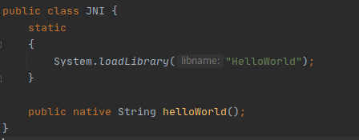
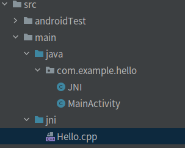
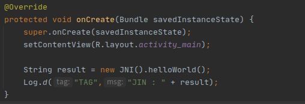

[toc]

#### 1、NDK 

NDK： Native Develop Kit

- 一套允许您使用原生代码语言(例如C和C++) 实现部分应用的工具集

NDK作用：

1. 在平台之间移植其应用
2. 重复使用现在库，或者提供其自己的库重复使用
3. 在某些情况下提性能，特别是像游戏这种计算密集型应用
4. 使用第三方库，现在许多第三方库都是由C/C++库编写的，比如Ffmpeg这样库。
5. 不依赖于Dalvik Java虚拟机的设计
6. 代码的保护。由于APK的Java层代码很容易被反编译，而C/C++库反编译难度大。

上层通过JNI调用NDK层

#### 2、JNI

- 协调数据类型，是JNI的重点内容

JNI，全称为Java Native Interface，即Java本地接口。

JNI下一共涉及到三个角色：C/C++代码、本地方法接口类、Java层中具体业务类

##### （1）JNI的命名规则

```
extern "C"
JNIExport jstring JNICALL 
Java_com_example_hellojni_MainActivity_stringFromJNI( JNIEnv* env,jobject thiz ) {

}
```

- `extern "C"`：如果用的是C++，则需要在前面加上extern "C"声明；如果用的是C语言，则不需要加

- `JNIExport`与`JNICALL`是关键字

- `jstring`：返回值类型

- `Java_{packageName_className}_{functionName}(JNI_arguments)*`

  `com_example_hellojni`：包名（packageName）

  `MainActivity`：类名（className）

  `stringFromJNI`：方法名（functionName）

- `JNIEnv *env`： JNI的环境引用，一个非常有用的变量，可以通过它调用所有JNI函数

- `jobject /* this */`：函数调用者的对象，相当于java层中的**this**

##### （2）JNI实现

1. 在Java中先声明一个native方法
2. 编译Java源文件javac得到.class文件
3. 通过javah-jni命令导出JNI的.h头文件
4. 使用Java需要交互的本地代码，实现在Java中声明的Native方法
5. 将本地代码编译成动态库（Windows下时.dll文件，Linux下是.so文件，Mac下是.jnilib文件）
6. 通过Java命令执行Java程序，实现Java调用本地代码

##### （3）数据类型

- 基础数据类型
  - 在java的数据类型前加`j`
    - 如：`int`与`jint`
- 引用数据类型
  - 去掉前面的引用，在最后一个前加`j`
    - 如：`java.long.Object`与`jobject`
- 数组
  - 在类型前加`j`，将`[]`改为`Array`
    - 如：`int []`与`jintArray`

#### 3、JNI的返回值

- 返回字符串

  - C语言写法
    - `return (*env)->NewStringUTF(env,"return string");`

  - C++写法
    - `return env->NewStringUTF("return string");`


#### 4、JNI使用

##### （1）下载CMake与NDK

`File->Setting->Andriod SDK->SDK Tools`


##### （2）JNI配置

1）`CMakeLists.txt`

```
# CMakeLists.txt
# For more information about using CMake with Android Studio, read the
# documentation: https://d.android.com/studio/projects/add-native-code.html

# Sets the minimum version of CMake required to build the native library.
#CMakeLists.txt
cmake_minimum_required(VERSION 3.4.1)

# Creates and names a library, sets it as either STATIC
# or SHARED, and provides the relative paths to its source code.
add_library(
      # 设置so文件名称.
        HelloWorld
       # 设置这个so文件为共享.
       SHARED
       # Provides a relative path to your source file(s).
       src/main/jni/Hello.cpp)

# Searches for a specified prebuilt library and stores the path as a
# variable. Because CMake includes system libraries in the search path by
# default, you only need to specify the name of the public NDK library
# you want to add. CMake verifies that the library exists before
# completing its build.
find_library( # Sets the name of the path variable.
       log-lib
       # Specifies the name of the NDK library that
       # you want CMake to locate.
       log )

# Specifies libraries CMake should link to your target library. You
# can link multiple libraries, such as libraries you define in this
# build script, prebuilt third-party libraries, or system libraries.
target_link_libraries( # Specifies the target library.
            # 制定目标库.
            HelloWorld
            # Links the target library to the log library
            # included in the NDK.
            ${log-lib} )
```

2）`build.gradle`

增加`externalNativeBuild`

```
...
android {
		...

        externalNativeBuild {
            cmake {
                // 指定编译架构
                abiFilters 'arm64-v8a','armeabi-v7a','x86','x86_64'
            }
        }
    }
    
    externalNativeBuild {
        cmake {
            path 'CMakeLists.txt'
        }
    }
    
    buildTypes {
        	...
    }
    compileOptions {
    		...
    }
}

dependencies {
		...
}
```

3）`local.properties`

增加ndk的路径，如：`ndk.dir=/home/puchengwei/Android/Sdk/ndk-bundle`

##### （3）使用

（1）在Java的包下创建类

1. 在这个类中声明被调用的库的名字
2. 对需要被调用的方法进行声明



（2）在main下创建jni文件夹，然后在jni文件夹下创建cpp文件，在cpp文件夹下实现`helloWorld`方法



（3）在MainActivity中调用



#### 5、JavaVm与JNIEnv

JNI定义了两种关键数据结构，`JavaVM`与`JNIEnv`。本质上都是指向函数表指针的指针。

- `JavaVM`提供“调用接口（invocation）”函数，允许使用中创建和销毁一个JavaVm。理论上在一个进程中拥有多个JavaVM对象，但Andriod只允许存在一个

#### 6、打印log

```
// 引入头文件
#include <android/log.h>

// 宏定义
#define LOG_TAG "TAG"
#define LOGD(...) __android_log_print(ANDROID_LOG_DEBUG, LOG_TAG, __VA_ARGS__)
#define LOGE(...) __android_log_print(ANDROID_LOG_ERROR, LOG_TAG, __VA_ARGS__)
#define LOGI(...) __android_log_print(ANDROID_LOG_INFO, LOG_TAG, __VA_ARGS__)
#define LOGV(...) __android_log_print(ANDROID_LOG_VERBOSE, LOG_TAG, __VA_ARGS__)
#define LOGW(...) __android_log_print(ANDROID_LOG_WARN, LOG_TAG, __VA_ARGS__)

// 使用
LOGD("D:%d\n", 99);
```

#### 7、常用场景

| 方法              | 作用 |
| ----------------- | ---- |
| GetStringUTFChars |      |
|jobject GetObjectArrayElement(JNIEnv *env, jobjectArray array, jsize index);|返回Object数组的元素（ index：数组下标）|
|void SetObjectArrayElement(JNIEnv *env, jobjectArray array, jsize index, jobject value);| 设置Object数组的元素                     |
||                                          |
||                                          |
|||
|||
|||
|||
|||
|||
|||
|||
|||
|||
|||
|||
|||
|||
|||


##### （1）字符串传递（java->native）

```
 	...(JNIEnv *env, jobject, jstring j_str) {
 		const char *c_str = nullptr;
 		c_str = env->GetStringUTFChars(j_str, NULL);	// 获取字符串
 		
 		// 若使用GetStringUTFRegion与GetStringRegion，则内部未分配内存，无需释放
 		env->ReleaseStringUTFChars(j_str, c_str);	// 释放内存
 	}
```

##### （2）字符串返回（native->java）

```
...(JNIEnv *env, jobject) {
		return env->NewStringUTF(str);	// 返回字符串
}
```

##### （3）数组传递(java->java)

###### 1）基本类型数组

```
...(JNIEnv *env, jobject, jintArray j_array) {
		int arr_len = env->GetArrayLength(j_array);	// 获取数组长度
		
		int *array = env->GetIntArrayElements(j_array, NULL);	// 获取数组元素
		
		env->ReleaseIntArrayElements(j_array, array, 0);	// 释放内存
}
```

###### 2）对象类型数组

```
...(JNIEnv *env, jobject, jobjectArray j_str_array) {
		int array_size = env->GetArrayLength(j_str_array);
		
		for (int i = 0; i < array_size; i++) {
				jstring j_str = (jstring)(env->GetObjectArrayElement(j_str_array, i));
				const char *c_str = env->GetStringUTFChars(j_str, NULL);
				...
				
				env->ReleaseStringUTFChars(j_str, c_str);
		}
}
```

##### （4）其他复杂对象传递（java->native）

```
```

