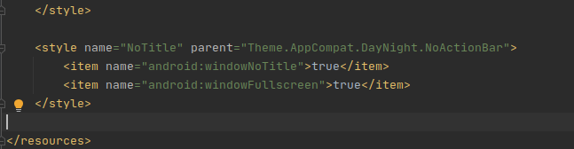
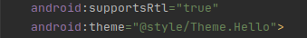

Andriod Studio隐藏虚拟机的状态栏和标题

#### 1、隐藏状态栏


（1）在`themes.xml（app->src->main->res->values）`中添加

```
    <style name="NoTitle" parent="Theme.AppCompat.DayNight.NoActionBar">
        <item name="android:windowNoTitle">true</item>
        <item name="android:windowFullscreen">true</item>
    </style>
```



（2）在`AndroidManifest.xml（app->src->main）`中

将`android:theme="@style/Theme.Hello"`改为`android:theme="@style/NoTitle"`



#### 2、去掉标题

在`MainActivity.java`将`public class MainActivity extends AppCompatActivity {`改为`extends Activity`

#### 

