Android Studio使用

### 1、新建工程

File->new->project

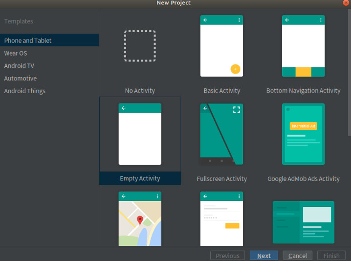

选择对应的模板，我一般选择Empty Acticity，然后next->finsh就行

### 2、主界面

#### （1）项目结构

#### 一般在左上角会出现你的项目，但是显示的时Android；

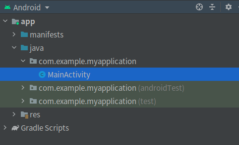

点击Android，选择Project就能看见自己的项目了

- 在app->src->main->java里面编写自己的代码或者新建java文件

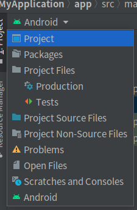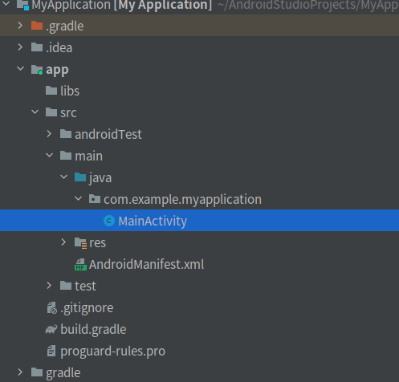

- 在res的layout的xml可以编辑页面布局，values里可以修改string的值，然后在activity_main.xml中使用

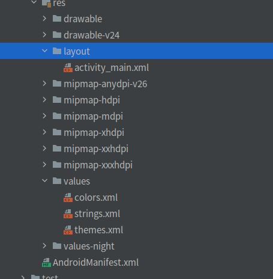

[androidmanifest.xml文件的作用](https://www.php.cn/faq/465483.html)

#### （2）上方工具条

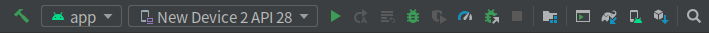

- 锤子：那必然是build了

- android小人这个一般没选

- 第三个就是选择运行设备了，虚拟机，手机，板子之类的

  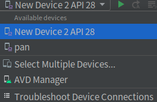

- start、restart、xxx、debug、xxx、xxx、xxx、stop（xxx表示没用过(⊙﹏⊙)）

- AVDManager

  

#### （3）下方工具条

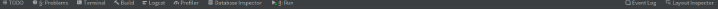

一般也就用Problems、Build、Logcat（查看打印的log）、Run这几个

### 3、虚拟机设置

运行android必须得有一个虚拟机，它会有一个默认的，也能新建一个

#### 新建虚拟机

- 点击AVDManager，选择左下角的新建

  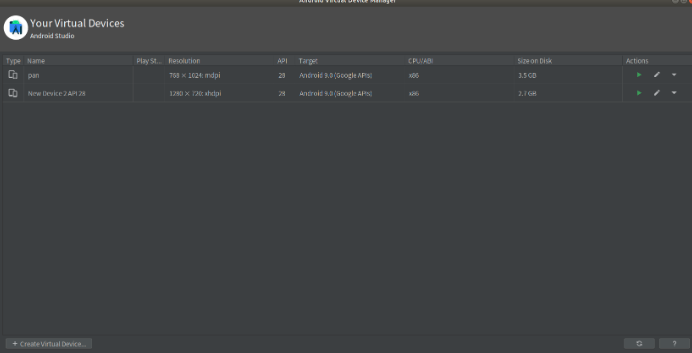

- 能从已有的里面选，也能自己设计一个界面（New Hardware Profile），或者import

  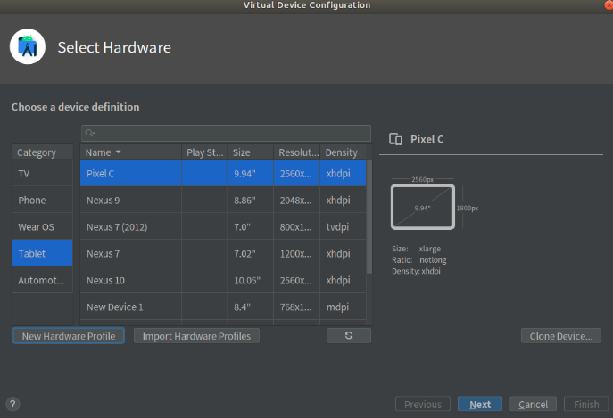

- New Hardware Profile，对自己的页面进行设置

  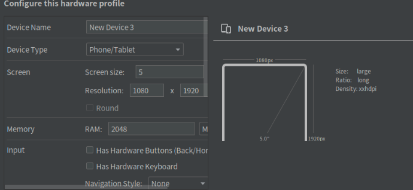

- 选择next后，会选择镜像，R、Q、Pie、O之类的

  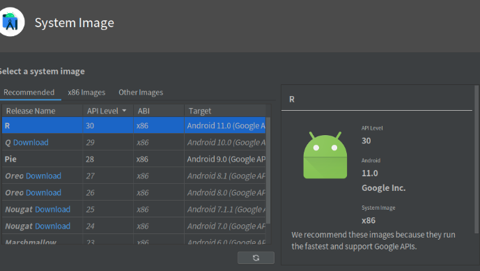

#### 4、运行Hello World

- 配置完直接点运行就可以运行Hello World的程序了

  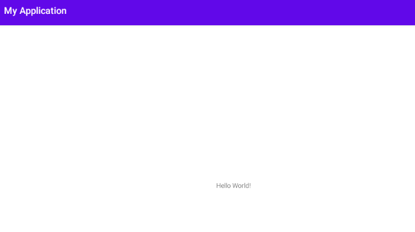

- 在activity_main.xml中编写自己的布局，可以直接写代码，也能直接在Design中直接拖组件（Code是代码界面，Split是代码和设计，Design是设计）

  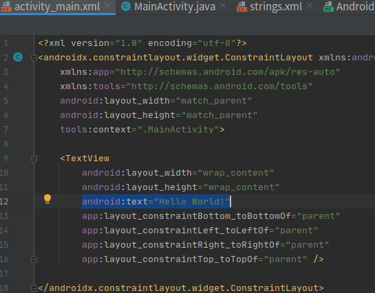

  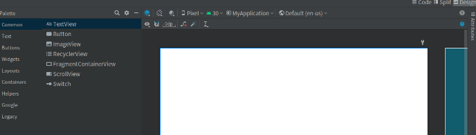

主页面的Hello World就是在activity_main.xml的TextView中设置的

