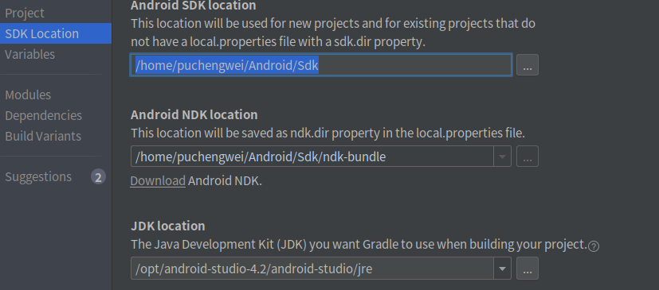
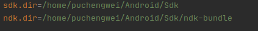
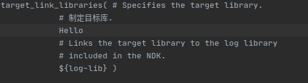

### 问题1

```E/AndroidRuntime: FATAL EXCEPTION: main
Process: com.example.myjni, PID: 7953
    java.lang.UnsatisfiedLinkError: No implementation found for java.lang.String com.example.myjni.JNI.sayHello() (tried Java_com_example_myjni_JNI_sayHello and Java_com_example_myjni_JNI_sayHello__)
```

未找到jni方法，链接.so库错误

- 在local.properties中ndk.dir的路径有问题，有可能是不存在或者版本不对应

- `File->Project Structure`，在这里点击Download，下载相应版本

  

- 修改ndk的路径

  

### 问题2

`error: member reference type 'JNIEnv' (aka '_JNIEnv') is not a pointer; did you mean to use '.'?`

env变量在C和C++语法表达不一致引起

`error: too many arguments to function call, expected single argument 'bytes', have 2 arguments`

C和C++的NewStringUTF参数不一致导致

### 问题3

```
CMake Error at /.../CMakeLists.txt:33 (target_link_libraries):
  Cannot specify link libraries for target "Hello" which is not built by this
```

- 在修改库名字时，未修改`CMakeLists.txt`中的`target_link_libraries`

  

