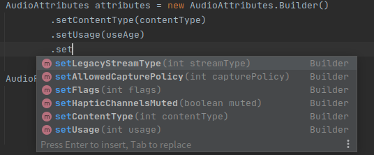
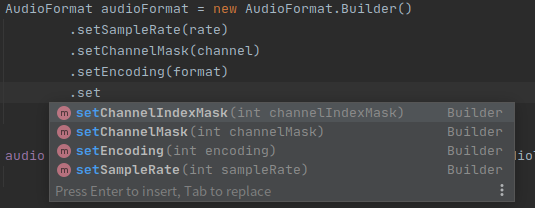
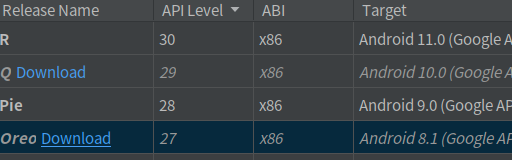

### 一、audio的初始化

#### 1、[audioTrack](https://developer.android.google.cn/reference/android/media/AudioTrack#AudioTrack(android.media.AudioAttributes,%20android.media.AudioFormat,%20int,%20int,%20int))

```
public AudioTrack (AudioAttributes attributes, 
                AudioFormat format, 
                int bufferSizeInBytes, 
                int mode, 
                int sessionId)；
```

- attributes：AudioAttributes 一个非空`AudioAttributes`实例
- format：AudioFormat 配置音频格式参数
- bufferSizeInBytes：从其中读取音频数据以进行播放的内部缓冲区的总大小（以字节为单位）
- mode：流或者静态缓冲区
- sessionId：AudioTrack 必须附加到的音频会话的 ID

#### 2、[AudioAttributes](https://developer.android.google.cn/reference/android/media/AudioAttributes.Builder)



- `setLegacyStreamType`
  - 将属性设置为从传统流类型推断的属性。
  - **注意**：不要将此方法与设置任何其他属性（例如用法、内容类型、标志或触觉控制）结合使用，因为==此方法将覆盖先前在`Builder`设置的值==。在一般情况下，避免使用它，直接设置`setUsage(int)`和`setContentType(int)`。
- `setAllowedCapturePolicy`
  - 设置音频是否可以被其他应用程序或系统捕获。默认值为`AudioAttributes#ALLOW_CAPTURE_BY_ALL`
- `setFlags`
  - 设置标志的组合
- `setHapticChannelsMuted`
  - 指定在是否开启触觉。默认触觉被禁用
- `setContentType`
  - 设置音频的属性，如语音或音乐
- `setUsage`
  - 设置音频信号的用途，如闹钟或铃声

#### 3、[AudioFormat](https://developer.android.google.cn/reference/android/media/AudioFormat.Builder)



- `setChannelIndexMask`
  - 设置通道索引掩码。如果指定了通道索引掩码，则不需要通道位置掩码
- `setChannelMask`
  - 设置通道位置掩码
  - 对于`AudioRecord`，值为 `AudioFormat#CHANNEL_IN_MONO`or `AudioFormat#CHANNEL_IN_STEREO`
- `setEncoding`
  - 设置数据编码格式
- `setSampleRate`
  - 设置采样率

#### 4、例

```
// contentType = AudioAttributes.CONTENT_TYPE_MUSIC ；
// usage = AudioAttributes.USAGE_GAME;
// rate = 44100;
// channel= AudioFormat.CHANNEL_OUT_STEREO;
// encoding = AudioFormat.ENCODING_PCM_16BIT;

  if (Build.VERSION.SDK_INT >= Build.VERSION_CODES.O) {
  	AudioAttributes attributes = new AudioAttributes.Builder()
		.setContentType(contentType)
		.setUsage(usage)
		.build();
	AudioFormat audioFormat = new AudioFormat.Builder()
		.setSampleRate(rate)
		.setChannelMask(channel)
		.setEncoding(encoding)
		.build();

	audio = new AudioTrack(attributes,audioFormat, minBufferSize,AudioTrack.MODE_STREAM,
                    AudioManager.AUDIO_SESSION_ID_GENERATE);
}
```

`  if (Build.VERSION.SDK_INT >= Build.VERSION_CODES.O) `是用来判断版本的

- 

### 二、播放pcm音频

由于播放的是流模式的音频，故需要一次一次将数据写入

#### 在线程中读入pcm数据

```
    // InputStream   pcmData;
    
    public void startPlay(InputStream pcm) {
        try {
            pcmData = new DataInputStream(pcm);
            readDataThread = new ReadDataThread();
            readDataThread.start();
        } catch (Exception e) {
            Log.e("TAG", "startPlay: "+e.getMessage());
            e.printStackTrace();
        }
    }
```

（1）启动启动音频设备

（2）创建一个buffer缓冲区，每次读入minBufferSize

（3）count标志文件是否读取完成

（4）最后将数据从缓冲区写入到AudioTrack对象

```
    // minBufferSize = AudioTrack.getMinBufferSize(rate, channel, encoding);
    
    class ReadDataThread extends Thread {
        @Override
        public void run() {
            super.run();
            try {
            	audio.play();
                byte[] buffer = new byte[minBufferSize];
                int count = 0;

                Log.e("TAG", "start play");
                while(true)
                {
                    count = pcmData.read(buffer);
                    if(count == -1) {   // 结束
                        break;
                    }

                    // 从缓冲区写入到AudioTrack对象中
                    audio.write(buffer, 0, minBufferSize);
                }
                Log.e("TAG", "!");
            } catch(Exception e) {
                Log.e("TAG", "startPlay: " + e.getMessage());
                e.printStackTrace();
            }
        }
    }
```

### 三、获取PCM音频

[MP3转pcm](https://blog.csdn.net/m0_37599645/article/details/111657806)

下载FFmpeg，然后在命令窗口输入：

`ffmpeg -i buweishui.mp3 -ar 44100 -ac 2 -f s16le 48000_2_s16le.pcm`

