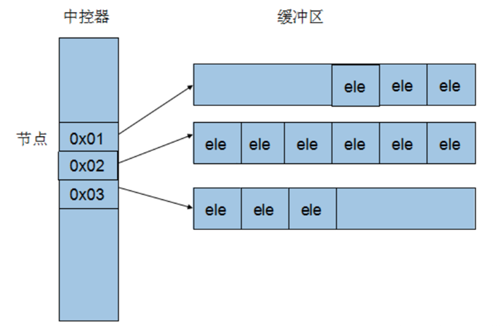

[【C/C++】STL详解](https://blog.csdn.net/qq_42322103/article/details/99685797#t11)

[toc]

### 一、介绍

STL（Standard Template Library）：标准模板库

#### 1、STL六大组件

- 容器、算法、迭代器、仿函数、适配器（配接器）、空间配置器
  - **容器**
    - 各种数据结构，如`vector、list、deque、set、map`等，用来存放数据。从实现角度来看，`STL`容器是一种`class template`
  - **算法**
    - 各种常用的算法，如`sort、find、copy、for_each`。从实现角度来看，`STL`算法是一种`function template`
  - **迭代器**
    - 扮演容器与算法之间的胶合剂，共5种类型。从实现角度来看，迭代器时一种将`operator*、operator->、operator++、operator-`等指针相关操作予以重载的`class tamplate`。所有STL容器都附带有自己专属的迭代器，只有容器设计者才知道如何遍历自己的元素。原生指针（`native pointer`）也是一种迭代器
  - **仿函数**
    - 行为类似函数，可作为算法的某种策略。从实现角度看，仿函数是一种重载了`operator()`的`class`或者`class template`
  - **适配器**
    - 一种用来修饰容器或者仿函数或者迭代器接口的东西
  - **空间配置器**
    - 负责空间的配置与管理。从实现角度看，配置器是一个实现了动态空间配置、空间管理、空间释放的`class template`
- STL六大组件的交互关系
  - 容器通过空间配置器取得数据存储空间
  - 算法通过迭代器存储容器中的内容
  - 仿函数可以协助算法完成不同的策略的变化
  - 适配器可以修饰仿函数

#### 2、三大组件介绍

##### （1）容器

容器分为序列式容器和关联式容器

- 序列式容器强调值的排序，序列式容器中每个元素均有固定的位置，除非用删除或插入操作改变这个位置。如：vector容器、deque容器、list容器等
- 关联式容器是非线性的树结构（二叉树结构）。个元素之间不存在严格物理上的顺序关系，即元素在容器中并没有保存元素置入ring去的逻辑顺序。
  - 关联式容器另外一个显著特点是：在值中选择一个值作为关键字key，作为索引方便查找。Set/multisize容器、Map\multimap容器

##### （2）算法

算法分为质变算法和非质变算法

- 质变算法：指运算过程中会更改区间内的元素的内容。如：拷贝、替换、删除等
- 非质变算法：指运算过程中不会更改区间内的元素的内容。如：查找、计数、遍历、寻找极值等

##### （3）迭代器

迭代器的种类

| 迭代器         |                       功能                       | 描述                                   |
| -------------- | :----------------------------------------------: | -------------------------------------- |
| 输入迭代器     |               提供对数据的只读访问               | 只读，支持++、==、！=                  |
| 输出迭代器     |               提供对数据的只写访问               | 只写，支持++                           |
| 前向迭代器     |         提供读写操作，并能向前推进迭代器         | 读写，支持++、==、！=                  |
| 双向迭代器     |         提供读写操作，并能向前和向后操作         | 读写，支持++、-                        |
| 随机访问迭代器 | 提供读写操作，并能以跳跃的方式访问容器的任意数据 | 读写，支持++、-、[n]、-n、<、<=、>、>= |

### 二、常用容器

#### 1、vector容器

- 单向开口的连续内存空间

- 维护线性空间，普通指针都可以作为vector的迭代器；支持随机存储
- vector提供的是随机访问迭代器

##### （1）vector数据结构

以两个迭代器`_Myfirst`和`_Mylast`分别指向配置得来的连续空间中目前已被连续使用的范围，并以迭代器`_Myend`指向整块连续内存空间的尾端

- 动态增加大小，并不是在原空间之后续接新空间（因为无法保证原空间之后还有能分配的空间），而是一块更大的内存空间，然后将元数据拷贝新空间，并释放空间。

  ==因此，对vector的任何操作，一旦引起空间的重新配置，指向原vector的所有迭代器就都失效了==

##### （2）vector常用API

**vector构造函数**

```
vector<T> v;	// 采用模板实现类实现，默认构造函数
vector(v.begin(), v.end());	// 将v(begin,end)区间中的元素拷贝给本身
vector(n, elem);	// 构造函数将n个elem拷贝给本身
```

**vector常用赋值操作**

```
assign(beg, end);	// 将[begin,end]区间的数据拷贝赋值给本身
assign(n.elem);		// 将n个elem拷贝赋值给本身
vector& operator = (const vector &vec);		// 重载等号操作符
swap(vec);		// 将vec与本身的元素互换
```

**vector大小操作**

```
size();		// 返回容器中元素的个数
empty();	// 判断容器是否为空
resize(int num);	// 重新指定容器的长度为num，若容器变长，则以默认值填充。若变短则删除超过部分
resize(int num, elem);	// 若容器变长，则以elem填充。若变短则删除超过部分
capacity();		// 容器的容量
reserve(int len);	// 容器预留len个元素长度，预留位置不初始化，元素不可访问
```

**vector数据存取操作**

```
at(int idx);	// 返回索引idx所指的数据，若idx越界，抛出out_of_range错误
operator[];		// 返回索引ids所指的数据，越界时，运行直接报错
front();	// 返回容器的第一个元素
back();		// 返回容器的最后一个元素
data();		// 返回一个指针，该指针指向矢量内部用于存储元素的内存数组
```

**vector插入和删除操作**

```
insert(const_iterator pos, int count, ele);		// 迭代器指向的位置pos插入count个元素ele
push_back(ele);		// 尾部插入元素ele
pop_back();		// 删除最后一个元素
erase(const_iterator start, const_iterator end);		// 删除迭代器从start到end之间的元素
erase(const_iterator pos);		// 删除迭代器指向的元素
clear();		// 删除容器中所有元素
```

#### 2、deque容器

双向开口的连续性空间，即可以在头尾两端分别做元素的插入和删除操作

##### （1）与vector的区别

- deque允许使用常数项时间对头端进行元素的插入和删除

- deque没有容量的概念，是动态的以分段连续空间组合而成

  ==除非有必要，应该尽可能的使用vector，而不是deque；若对deque进行排序，可将deque完整复制到vector中进行排序，再将排好后的复制会deque==

##### （2）deque描述

Deque最大的工作就是维护这些分段连续的内存空间的整体性的假象，并提供随机存取的接口，代价就是复杂的迭代器架构


Deque采用一小块连续的内存空间，其中每一个节点都是一个指针，指向另一段连续性内存空间，称作缓冲区。缓冲区才是deque的储存空间的主体。



##### （3）deque常用API

**deque的构造函数**

```
deque<T> deqT;	// 默认构造形式
deque(beg, end);	// 构造函数将[beg,end]区间中的元素拷贝给本身
deque(n,elem);		// 构造函数将n个elem拷贝给本身
deque(const deque &deq);	// 拷贝构造函数
```

**deque赋值操作**

```
assign(beg, end);//将[beg, end)区间中的数据拷贝赋值给本身。
assign(n, elem);//将n个elem拷贝赋值给本身。
deque& operator=(const deque &deq); //重载等号操作符 
swap(deq);// 将deq与本身的元素互换
```

**deque大小操作**

```
deque.size();//返回容器中元素的个数
deque.empty();//判断容器是否为空
deque.resize(num);//重新指定容器的长度为num，若容器变长，则以默认值填充。若变短则删除超过部分
deque.resize(num, elem); //重新指定容器的长度为num，若容器变长，则以ele填充。若变短则删除超过部分
```

**deque双端插入和删除操作**

```
push_back(elem);//在容器尾部添加一个数据
push_front(elem);//在容器头部插入一个数据
pop_back();//删除容器最后一个数据
pop_front();//删除容器第一个数据
```

**deque数据存取**

```
at(idx);//返回索引idx所指的数据，如果idx越界，抛出out_of_range。
operator[];//返回索引idx所指的数据，如果idx越界，不抛出异常，直接出错。
front();//返回第一个数据。
back();//返回最后一个数据
```

**deque插入操作**

```
insert(pos,elem);//在pos位置插入一个elem元素的拷贝，返回新数据的位置。
insert(pos,n,elem);//在pos位置插入n个elem数据，无返回值。
insert(pos,beg,end);//在pos位置插入[beg,end)区间的数据，无返回值。
```

**deque删除操作**

```
clear();//移除容器的所有数据
erase(beg,end);//删除[beg,end)区间的数据，返回下一个数据的位置。
erase(pos);//删除pos位置的数据，返回下一个数据的位置。
```

#### 3、set容器

##### （1）基本概念

- **特性**
  - 所有元素都会根据元素的键值自动排序(low_first)、除重
  - set的元素不像map那样可以同时拥有实值(value)和键值(key)，set元素既是键值也是实值
  - set不允许两个元素有相同的键值

不能通过set的迭代器改变set元素的值，因为set元素值就是其键值，关系到set元素的排序规则。

set和list，当对容器中的元素进行插入操作或删除操作的时候，操作之前所有的迭代器，在操作完成后依然有效

##### （2）multiset

- multiset与set相同，唯一差别在于multiset允许键值重复。
- multiset与set的底层实现是红黑树

##### （3）初始化

```
set<T> s;
set<T> s(begin, end);
```

- begin和end分别为迭代器的开始和结束的标记（数组多为数据源）

  如：`set<T> s(arr, arr+sizeof(arr)/sizeof(*arr));`

##### （4）set常用API

**set构造函数**

```
set<T> st;						// set默认构造函数
multiset<T> mst;	  // multiset默认构造函数
set(const set &st);		// 拷贝构造函数
```

**set赋值操作**

```
set & operator = (const set &st);	// 重载等号操作符
swap(st);												 // 交换两个集合容器
```

**set大小操作**

```
size();			// 返回容器中元素的数目
empty();	// 判断容器是否为空
```

**set插入和删除操作**

```
insert(elem);			// 在容器中插入元素
clear();						// 清除所有元素
erase();						// 删除pos迭代器所指的元素，返回下一个元素的迭代器
erase(beg, end);	  // 删除区间[beg, end]的所有元素，返回下一个元素的迭代器
erase(elem);			 // 删除容器中值为elem的元素
```

**set查找操作**

```
find(key); 			// 查找键key是否存在，若存在，返回该键的元素的迭代器；若不存在，返回set.end()
count(key);		// 查找键key的元素个数
lower_bound(keyElem);		// 返回第一个key<=keyElem元素的迭代器
upper_bound(keyElem);		// 返回第一个key>keyElem元素的迭代器
equal_range(keyElem);		   // 返回容器中key与keyElem相等的上下限的两个迭代器
```

#### 4、stack容器

##### （1）基本概念

- stack是一种`先进后出`（First In Last Out，FILO）的数据结构

- 除了栈顶元素，没有其他任何方法能取得stack的其他元素，stack不允许遍历
- stack没有迭代器

##### （2）常用API

**stack构造函数**

```
stack<T> stkT;						 // stack采用模板类实现，stack对象的默认构造形式
stack(const stack &stk);	// 拷贝构造函数
```

**stack赋值操作**

```
stack& operator=(const stack &stk);		// 重载等号操作符
```

**stack数据存取操作**

```
push(elem);			// 向栈顶添加元素
pop();					// 从栈顶移除第一个元素
top();					// 返回栈顶元素
```

**stack大小操作**

```
empty();		// 判断堆栈是否为空
size();				//	返回堆栈大小
```

#### 5、queue容器

##### （1）基本概念

- queue是一种`先进先出`（First In First Out，FIFO）的数据结构
- queue容器允许从一段新增元素，从另一端移除元素
- 只有queue的顶端元素，才有机会被取用；queue不提供迭代器

##### （2）queue常用API

**queue构造函数**

```
queue<T> queT;						// queue采用模板类实现，queue对象的默认构造形式
queue(const queue &que);// 拷贝构造函数
```

**存取、插入和删除操作**

```
push(elem);		// 往对尾添加元素
pop();				   	// 从对头移除第一个元素
back();				  	// 返回最后一个元素
front();				// 返回第一个元素
```

**queue赋值操作**

```
queue& operator=(const queue &que);		// 重载等号操作符
```

**queue大小操作**

```
empty();		// 判断队列是否为空
size();				// 返回队列的大小
```


