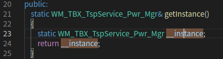
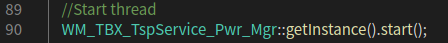

TSPService

1、`WM_TBX_TspService_Pwr_Mgr.h`头文件中

- 即`static 类名& 方法名(){}`

返回类型是类`WM_TBX_TspService_Pwr_Mgr`的实例`__instance`

在`WM_TBX_TspService_Main.cpp`中调用

Q：__instance需不需要初始化？在哪里初始化？

- 可以通过类名+方法名调用的方法叫静态方法，属于类级别方法。类方法可以在不实例化对象的前提下直接调用。
  - 且静态方法体内不能应用任何实例变量和实例方法

