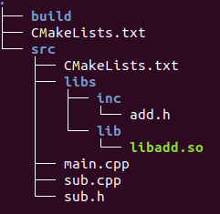

MakeLists.txt脚本

[toc]

### 一、运行第一个程序

#### 1、编写`CMakeLists.txt`文件

```
# 指定cmake的最低版本
# specify cmake minium version
cmake_minimum_required(VERSION 2.6)

# 指定需要编译的源文件(.cpp)的目录
# specify source file dir
# .(圆点）代表根目录
aux_source_directory(. DIR_SRCS)

# 指定需要包含的头文件的目录
# specify header file dir
add_executable(demo ${DIR_SRCS})
```

#### 2、生成Makefile文件

使用`cmake .`命令

#### 3、编译

使用`make`命令进行编译

#### 4、运行

使用`./`进行运行

### 二、CMakeLists.txt的编写

#### 1、指定cmake最低版本号

- `cmake_minimum_required(VERSION xxx)`

#### 2、设置项目名称

- `project(demo)`

#### 3、设置编译类型

```
add_executalbe(demo demo.cpp)	# 生成可执行文件me
add_library(common STATIC util.cpp)	# 生成静态库（common为名字，util.cpp为代码）
add_library(common SHARED util.cpp)	# 生成动态库或共享库
# add_library 默认时静态库，通过以上命令生成文件名字
```

- 在 Linux 下是：

  - demo
  - libcommon.a
  - libcommon.so

  在 Windows 下是：

  - demo.exe
  - common.lib
  - common.dll

#### 4、指定编译包含的源文件

##### 4.1 明确指定包含哪些源文件

`add_library(demo demo.cpp test.cpp util.cpp)`

##### 4.2搜索所有的cpp文件

```
aux_soure_directory(dir VAR) # 发现一个目录下所有的源代码文件并将列表储存在一个变量中
aux_source_directory(. SRC_LIST) # 搜索当前目录下的所有.cpp文件
add_library(demo $(SRCLIST))
```

##### 4.3自定义搜索规则

```
file(GLOB SRC_LIST "*.cpp" "protocol/*.cpp")
add_library(demo ${SRC_LIST})
# 或者
file(GLOB SRC_LIST "*.cpp")
file(GLOB SRC_PROTOCOL_LIST "protocol/*.cpp")
add_librart(demo ${SRC_LIST} {SRC_PROTOCOL_LIST})
# 或者
aux_source_directory(. SRC_LIST)
aux_source_directory(protocol SRC_PROTOCOL_LIST)
add_library(demo ${SRC_LIST} ${SRC_PROTOCOL_LIST})
```

#### 5、查找指定的库文件

`find_library(VAR name path)`查找指定的预编译库，并将它的路劲存储在变量中。默认的搜索路径为cmake包含的系统库里，因此如果是NDK的公共库只需要指定库的name即可

```
# Searches for a specified prebuilt library and stores the path as a
# variable. Because CMake includes system libraries in the search path by
# default, you only need to specify the name of the public NDK library
# you want to add. CMake verifies that the library exists before
# completing its build.
find_library( # Sets the name of the path variable.
       log-lib
       
       # Specifies the name of the NDK library that
       # you want CMake to locate.
       log )
```

类似的命令还有 find_file()、find_path()、find_program()、find_package()

#### 6、设置包含的目录

```
include_directories(
    ${CMAKE_CURRENT_SOURCE_DIR}
    ${CMAKE_CURRENT_BINARY_DIR}
    ${CMAKE_CURRENT_SOURCE_DIR}/include
)
```

Linux 下还可以通过如下方式设置包含的目录

`set(CMAKE_CXX_FLAGS "${CMAKE_CXX_FLAGS} -I${CMAKE_CURRENT_SOURCE_DIR}")`

#### 7、设置链接库搜索目录

```
link_directories(
    ${CMAKE_CURRENT_SOURCE_DIR}/libs
)
```

#### 8、设置target需要链接的库

```
# Specifies libraries CMake should link to your target library. You
# can link multiple libraries, such as libraries you define in this
# build script, prebuilt third-party libraries, or system libraries.
target_link_libraries( # Specifies the target library.
            # 制定目标库.
            HelloWorld
            
            # Links the target library to the log library
            # included in the NDK.
            # log-lib 是上面 find_library 指定的变量名
            ${log-lib} )
```

##### 8.1指定链接动态库或静态库

```
target_link_libraries(demo libface.a) # 链接libface.a
target_link_libraries(demo libface.so) # 链接libface.so
```

##### 8.2 指定全路径

```
target_link_libraries(demo ${CMAKE_CURRENT_SOURCE_DIR}/libs/libface.a)
target_link_libraries(demo ${CMAKE_CURRENT_SOURCE_DIR}/libs/libface.so)
```

##### 8.3指定链接多个库

```
target_link_libraries(demo
    ${CMAKE_CURRENT_SOURCE_DIR}/libs/libface.a
    boost_system.a
    boost_thread
    pthread)
```

### 三、动态链接库

#### 1、生成动态链接库

```
cmake_minimum_required(VERSION 3.10.2)
 
#设置此工程的源码
set(SRC add.cpp)

#设置输出的库的类型（SHARED）和名字（add）
add_library(add SHARED ${SRC})
```

- 会生成`libadd.so`库文件

#### 2、调用动态链接库



```
cmake_minimum_required(VERSION 3.10.2)

# 被链接的库的相对路径
link_directories(../src/libs/lib/libadd.so)

# 被链接库的头文件相对路径
include_directories(../src/libs/inc)

# 查找当前目录下的所有源文件
# 并将名称保存到 DIR_SRC 变量
aux_source_directory(. DIR_SRCS)
add_executable(myProject ${DIR_SRCS})

# 说明被链接的库的名字 add
target_link_libraries(myProject add)
```

- `cmkae .`生成Makefile文件
- `make`执行
- `./myProject`执行

### 四、静态链接库

#### 1、生成静态链接库

```
cmake_minimum_required(VERSION 3.10.2)
 
#设置此工程的源码
set(SRC add.cpp)

#设置输出的库的类型（SHARED）和名字（add）
add_library(add STATIC ${SRC})
```

- 生成`libadd.a`文件

#### 2、调用静态链接库

```
cmake_minimum_required(VERSION 3.10.2)

# 被链接的库的相对路径
link_directories(../src/libs/lib)

# 被链接库的头文件相对路径
include_directories(../src/libs/inc)

# 查找当前目录下的所有源文件
# 并将名称保存到 DIR_SRC 变量
aux_source_directory(. DIR_SRCS)
add_executable(myProject ${DIR_SRCS})

# 说明被链接的库的名字 add
target_link_libraries(myProject add)
```